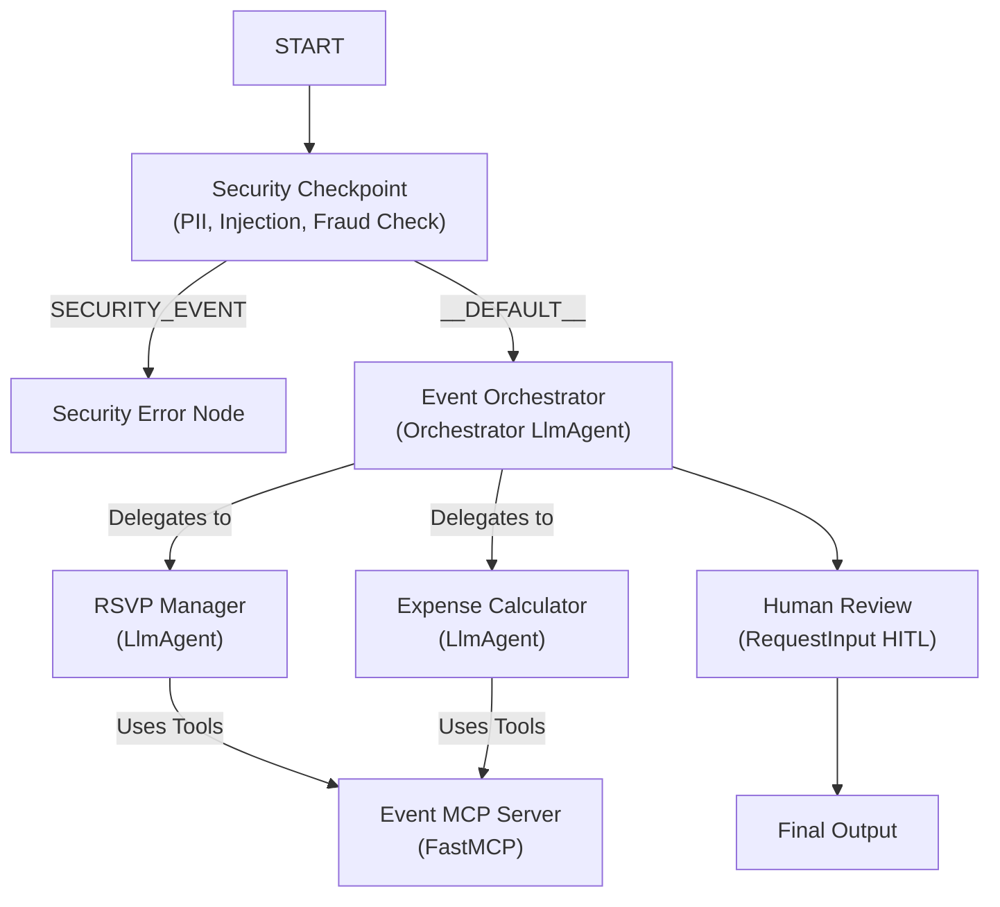
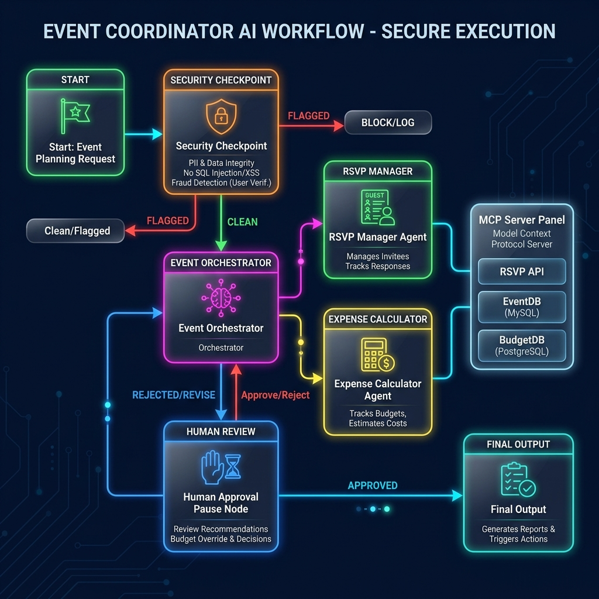
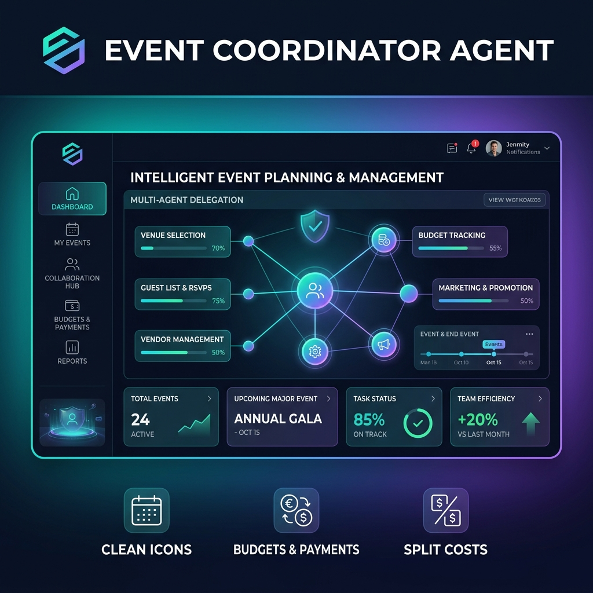

# Event Coordinator Agent

An intelligent, secure, and collaborative multi-agent event coordinator designed to simplify planning, RSVPs, and expense splitting using the Google ADK.

## Prerequisites

Before running the agent, make sure you have:
- **Python 3.11** or higher
- **uv**: Python package manager - [Install](https://docs.astral.sh/uv/getting-started/installation/)
- **Gemini API Key**: Obtain one from [Google AI Studio](https://aistudio.google.com/apikey)

## Quick Start

1. Clone the repository:
   ```bash
   git clone <repo-url>
   cd event-coordinator
   ```
2. Copy the example environment file and add your `GOOGLE_API_KEY`:
   ```bash
   cp .env.example .env
   ```
3. Install dependencies:
   ```bash
   make install
   ```
4. Start the interactive playground:
   ```bash
   make playground
   ```
   *(Opens the playground UI in your browser at http://localhost:18081)*

---

## Architecture Diagram

The multi-agent workflow architecture consists of the following components:



---

## How to Run

- **Playground (Interactive UI)**:
  - Run `make playground` to launch the Dev UI on http://localhost:18081.
- **FastAPI Server**:
  - Run `make run` to spin up the local server backend.

---

## Sample Test Cases

### Test Case 1: Standard Valid Event Request (Successful Flow)
- **Input**:
  ```json
  {
    "query": "Organize a dinner for 10 guests. We want Italian cuisine at the Community Center. John paid $250 for the venue, and Mary paid $100 for decorations. Split costs."
  }
  ```
- **Expected Flow**:
  1. `security_checkpoint` verifies query is clean (no PII, no injections, under fraud limit).
  2. `event_orchestrator` uses `rsvp_manager` to extract guest list and queries MCP for Italian catering options.
  3. `event_orchestrator` uses `expense_calculator` to compute total costs and splits.
  4. Workflow pauses at `human_review` requesting approval.
- **Verification**: Review the summary in the playground UI, approve by typing "Yes".

### Test Case 2: PII Policy Block (Security Action)
- **Input**:
  ```json
  {
    "query": "Set up a meeting. You can contact me at developer@example.com or +1-555-0199."
  }
  ```
- **Expected Flow**:
  1. `security_checkpoint` detects the email/phone number.
  2. Workflow routes to `security_error_node`.
  3. Output states: `🛡️ Security Blocked: PII block: emails/phone numbers are not allowed.`
- **Verification**: Verify that the execution stops immediately at the checkpoint.

### Test Case 3: Fraud/Expense Policy Block
- **Input**:
  ```json
  {
    "query": "Plan a gala at the Rooftop Lounge. John paid $5500 for the premium reservation."
  }
  ```
- **Expected Flow**:
  1. `security_checkpoint` identifies an expense value matching or exceeding $5,000.
  2. Workflow routes to `security_error_node`.
  3. Output states: `🛡️ Security Blocked: Policy block: Individual event expenses cannot equal or exceed $5,000 to prevent fraud.`
- **Verification**: Check the console/playground output showing the policy block.

---

## Troubleshooting

1. **429 Resource Exhausted / Quota Limit**:
   - Switch models in the top model selector panel in the IDE (e.g. from `gemini-2.5-pro` to `gemini-2.5-flash-lite`).
2. **"No agents found" or "Got unexpected extra arguments"**:
   - Make sure you are launching the command from inside the `event-coordinator` directory using the real agent folder name: `uv run adk web app ...`
3. **Changes in code not reflected in playground (Windows)**:
   - On Windows, hot-reloading is disabled for `adk web` due to event loop conflicts. Terminate the running server and start it fresh.

---

## Assets

### Workflow Diagram


### Project Banner


## Demo Script

The demo script for walkthroughs and presentations can be found in [DEMO_SCRIPT.txt](DEMO_SCRIPT.txt).
