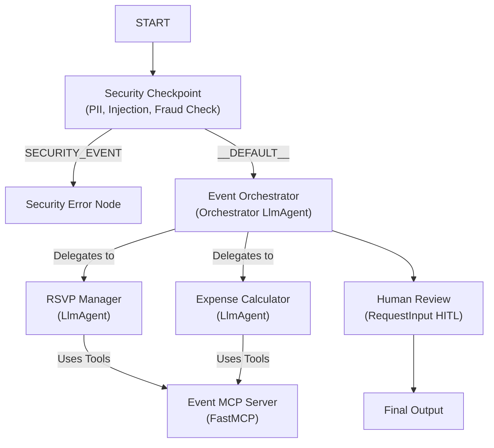

# Submission Write-Up: Event Coordinator Agent

## Problem Statement
Organizing events involving multiple attendees is often plagued by communication overhead and coordination challenges. Specifically:
1. **RSVP Tracking & Dietary Planning**: Manually consolidating attendee responses, food preferences, and dietary restrictions is error-prone.
2. **Expense Management**: Calculating costs, identifying who paid, splitting bills, and working out transaction details can cause friction.
3. **Information Retrieval**: Organizers spend excessive time looking up venue capacities and catering options to make decisions.

The **Event Coordinator Agent** solves this by providing a unified, secure, intelligent multi-agent system that processes plan requests, automatically checks policies, extracts RSVP details, queries local databases/APIs for venue/catering suitability, computes exact expense splits, and presents the draft plan to the organizer for approval.

---

## Solution Architecture

The multi-agent workflow architecture uses a structured DAG to route execution through security checks, specialized agents, and human approvals:

---

## Concepts Used

- **ADK Workflow**: Designed a robust graph layout with conditional and default transitions in [agent.py](file:///c:/Users/Admin/Desktop/Kaggle%20Capstone%20project/event-coordinator/app/agent.py#L280-L291) to guarantee execution integrity.
- **LlmAgent**: Deployed three specialized LLM agents in [agent.py](file:///c:/Users/Admin/Desktop/Kaggle%20Capstone%20project/event-coordinator/app/agent.py#L96-L142) (Orchestrator, RSVP Manager, Expense Calculator) for division of labor.
- **AgentTool**: Wrapped sub-agents as tools in [agent.py](file:///c:/Users/Admin/Desktop/Kaggle%20Capstone%20project/event-coordinator/app/agent.py#L125-L126) for the orchestrator to call.
- **MCP Server**: Implemented a standalone FastMCP server in [mcp_server.py](file:///c:/Users/Admin/Desktop/Kaggle%20Capstone%20project/event-coordinator/app/mcp_server.py) providing catering, venue capacity checking, and email generation capabilities.
- **Security Checkpoint**: Implemented the `security_checkpoint` node in [agent.py](file:///c:/Users/Admin/Desktop/Kaggle%20Capstone%20project/event-coordinator/app/agent.py#L147-L223) to perform safety validations (PII, prompt injection, budget limits) before triggering LLM calls.
- **Agents CLI**: Scaffolded the application using `agents-cli scaffold` to maintain standard deployment configurations.

---

## Security Design

1. **PII Redaction/Blocking**: Prevents emails and phone numbers from entering the orchestrator logic, preventing potential user information exposure.
2. **Prompt Injection Mitigation**: Blocks queries containing common jailbreak or instruction-override commands.
3. **Domain-Specific Fraud Protection**: Blocks individual expense items exceeding $5,000 to prevent automated fraud or large typos.
4. **Structured Audit Logs**: All security check decisions are logged as structured JSON to `sys.stderr` for easy monitoring and threat detection.

---

## MCP Server Design

The MCP server exposes three main tools to supply real-time context to the agents:
1. `get_catering_options`: Retrieves menus and calculates pricing based on cuisine and guest count.
2. `get_venue_details`: Looks up capacity, descriptions, and rental costs for venues, returning a capacity warning if the guest count exceeds limits.
3. `generate_invitation_email`: Automatically drafts the invitation details once the coordinator approves the plan.

---

## Human-in-the-Loop (HITL) Flow

A `human_review` step is wired using `RequestInput` right before finalization. Event coordination involves financial transactions and real-world bookings, so the agent must never book or finalize without a direct "Yes" from the organizer.

---

## Demo Walkthrough

### Test Scenario 1: Successful Coordination
- **Query**: `"Dinner for 10. Italian food at Community Center. John paid $250. Mary paid $100."`
- **Execution**: The security checkpoint passes. The orchestrator calls RSVP Manager (queries Community Center venue details and Italian catering options) and Expense Calculator (sums $350 and calculates individual splits). The user is prompted in the UI to review the plan and replies "Yes". The plan is finalized.

### Test Scenario 2: Security Violations
- **Query**: `"Plan a meeting. Contact me at admin@domain.com."`
- **Execution**: The security checkpoint flags the email address, records a `PII_BLOCKED` warning to the audit logs, and redirects to `security_error_node` preventing any LLM calls.

---

## Impact / Value Statement
This agent minimizes manual work and removes planning friction for families, friends, and small businesses. It automates calculations, validates data against strict security policies, and integrates external data queries seamlessly—delivering a secure, professional, and rapid planning experience.
